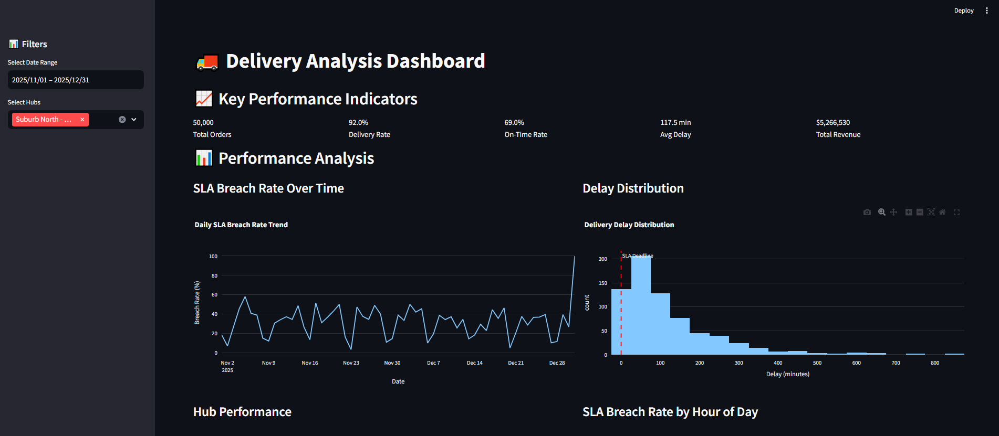

## Technologies Used
- SQL (Data Analysis)
- PostgreSQL (Data Modeling)
- Power BI (Visualization and Dashboards)
- Python (Alternative Analysis with pandas, matplotlib, seaborn)
- Streamlit (Interactive Dashboard)

## Getting Started

### Option 1: Interactive Dashboard (Recommended - Easiest)
1. Generate CSV data: `python delivery_analysis.py`
2. Launch dashboard: `python run_dashboard.py`
3. Open browser to `http://localhost:8501` for interactive analysis

**Features:**
- Real-time KPI metrics with filters
- Interactive charts (SLA breach trends, delay distributions)
- Hub and rider performance analysis
- Revenue analytics and order status tracking
- Detailed data tables with search and filtering

### Option 2: SQL + Power BI (Original Implementation)
1. Set up PostgreSQL database
2. Run SQL scripts: `\i sql/data_models.sql` and `\i sql/analysis_queries.sql`
3. Import CSV data into database tables
4. Create Power BI dashboards using guidelines in `dashboards/`

### Option 3: Python Analysis (Automated)
1. Run complete analysis: `python run.py`
2. View console output and `delivery_analysis_report.png`

## Prerequisites
- Python 3.8+ (for Options 1 & 3)
- PostgreSQL (for Option 2)
- Power BI Desktop (for Option 2)

## Data Files Generated
- `data/orders.csv`: 50,000 order records
- `data/deliveries.csv`: 46,009 delivery records with SLA analysis
- `data/hubs.csv`: 20 hub locations
- `data/riders.csv`: 195 rider assignments
- `delivery_analysis_report.png`: Static visualization report

## Key Dashboard Metrics
- **SLA Breach Rate**: Percentage of late deliveries
- **On-Time Delivery Rate**: Successful delivery performance
- **Average Delay**: Mean delay for breached deliveries
- **Hub Performance**: Breach rates by location
- **Hourly Patterns**: Delivery performance by time of day
- **Revenue Analytics**: Order value and status distribution
